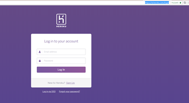
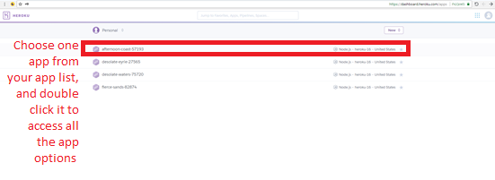
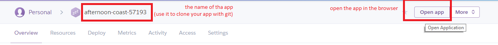
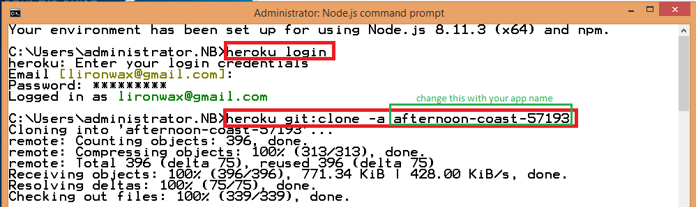
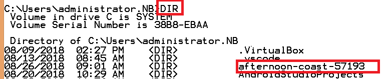

# Manage heroku app

* Open heroku dashboard with this url:
https://id.heroku.com/login   

   

and login to your account   

* Select a specific app from your app list   

* Clone the app repository to your comuter, in order to edit your app   

---

---
now you have the app in your local comuter:   

* Open your cloned app , and edit it
* Deploy your changes
Make some changes to the code you just cloned and deploy them to Heroku using Git.
```bash
git add .
git commit -am "commit message"
git push heroku master
```
