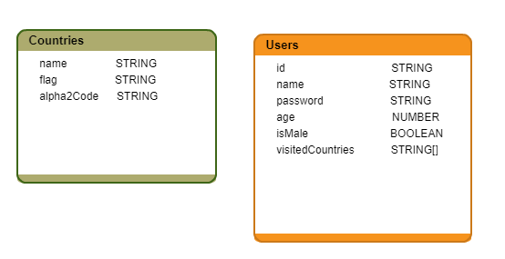

# Traveler app
#### This app conects to a mongo db server with the following models:   

   
#### The app contains the foolowing parts:
* Mongo server
* Node express server
* Angular frotend

## Run mongo server
* open the cli and run the following commands;
```bash
cd "C:\Program Files\MongoDB\Server\4.0\bin"
mongod
```
now the mongo server runs on port 27017

## Create a node server that connects to mongo
* create a new folder and open the cli in this folder's path
* add package.json file with this command:
```bash
npm init -y
```
* install this npm packages:
```bash
npm i -s express body-parser mongoose
```
this will add in the `package.json` file this part:
```json
"dependencies": {
    "body-parser": "^1.18.3",
    "express": "^4.16.3",
    "mongoose": "^5.2.14"
  }
  ```
  and a new folder named `node_modules` with all the installed packages.
  * add a new folder named models
  * add to the `models` folder, a new file named `country.js` with this content:
  ```javascript
  module.exports = {
    countryModel: {
        namee: String,
        flag: String,
        alpha2Code: String
    }
};
```
  * add to the `models` folder, a new file named `user.js` with this content:
```javascript
module.exports = {
    userModel: {
        id: String,
        name: String,
        password: String,
        age: Number,
        isMale: Boolean,
        visitedCountries: Array
    }
};
```
