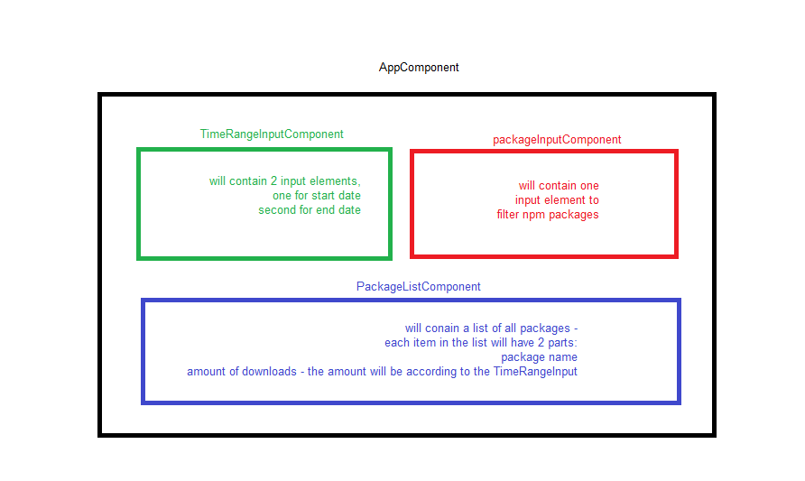

# Class task
### `PackageInputComponent`
* Create `PackageInputComponent` with an input element
### `TimeRangeInputComponent`
* Create `TimeRangeInputComponent` with two input element
###  `PackageListComponent`
* When the user enters input in the prev components, show a list with all npm packages that matches to the user input   
Use this url to get all the packages: https://api.npms.io/v2/search/suggestions?q=[[USER_INPUT]]&size=40
* Next to each package, show the amount of downloads, according to the dates range input.  
Use this url to get the amount of downloads for each package: https://api.npmjs.org/downloads/point/2016-02-01:2018-02-08/express

## Task diagram:

